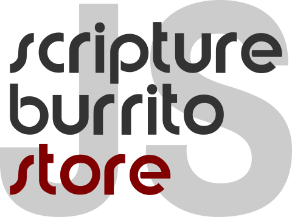

# Contributing to the Project

[scripture-burrito-store-js](../../README.md) is a collaborative project led by Mark Howe. There are many ways to contribute.

## Are you in the right place?

This project implements standards that are developed by the [Scripture Burrito](http://burrito.bible) Working Group. That group's repo is [here](https://github.com/bible-technology/scripture-burrito). If you want to discuss the Scripture Burrito standard itself, this would be the place to do so. Our project is about using that standard to do cool stuff.

This project, like every project, is based on some "fork in the road" decisions about implementation. It's work in progress, so everything is potentially up for discussion. However, given limited resources and deadlines, some decisions are unlikely to be revisited any time soon. These decisions include

- Javascript
- A preference for modern, vanilla Javascript
- Node

If anything in that list, or any other aspect of this project, is a deal-breaker for you, please consider forking this repo and doing it your way. We wish you the best. If your way turns out well (and is open source) we may consider stealing some of your ideas (with attribution). If your code works well for you, that's great. More implementations mean more Scripture Burritos, and that's a really good thing!  Regardless, in this project, we prefer writing working code to talking about writing code.

## Writing Code and Documentation

We welcome contributions of all kinds, including

- bug fixes
- code that implements new, core functionality
- code that provides alternative storage layers
- more and better unit tests
- more and better documentation

If you would like to contribute and do not have the necessary access, please create an issue on the repo and tell us about your ideas. (We don't promise to agree, but we'll do our best to be polite.)

## The Project's Talking Shop

We hold regular video meetings about the direction of this project. We'd like those meetings to be more crowded. The main qualifications for participation in these meetings are

- active particpation in the project through issues and/or PRs
- the intention to implement and ship software based on this project
