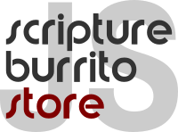

# Working with the Code

Developers working on [this codebase](../../README.md) use Linux, Windows and OSX, so the code ought to be deployable on many systems. We do not have the resources or, frankly, the inclination to try to test on every possible system.

Clone the repo, follow the instructions below and, if all goes well, you should see running tests and applications.

If not, please create an issue, with "HELP" in the title and a clear description of your issue, and we'll try to help.

If you hit a problem and find a solution, please consider submitting a PR so that others can benefit from your code or documentation.

## Project Structure

* **build**: Scripts and resources to make documentation and anything else that needs making

* **schema**: jsonschema schema

* **test**: Unit tests

* **doc**: Built documentation

* **code**: The JS!

## Running the Tests

The unit tests are written with mocha as the test executor. The module provides several scripts to run some or all tests. In order to run all tests, use `npm test`.

Mocha is required to be installed, so run `npm install mocha; npm test` for all tests. Other targets are "testSmoke", "testSchema", "testDbl", "testBundleImport", "testDblOab", "testSB01"

## Running Express

The module comes with a demo web-app launched using the express framework. In order to run the app, invoke `npm start`, which will launch a web server running on <http://localhost:3000/>
